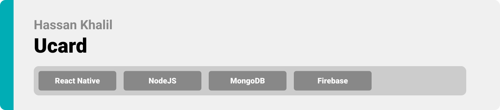
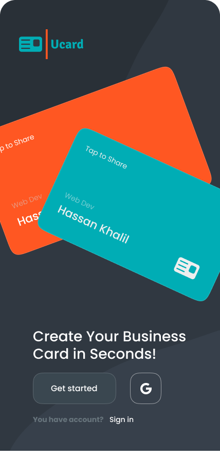
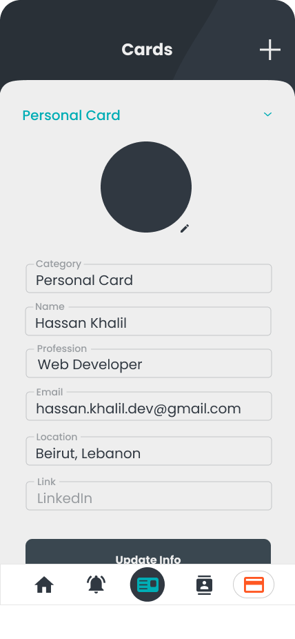
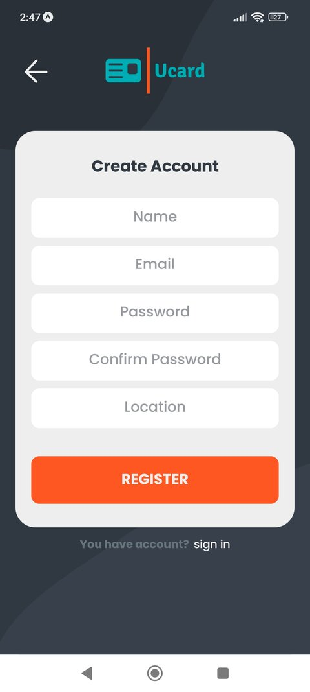
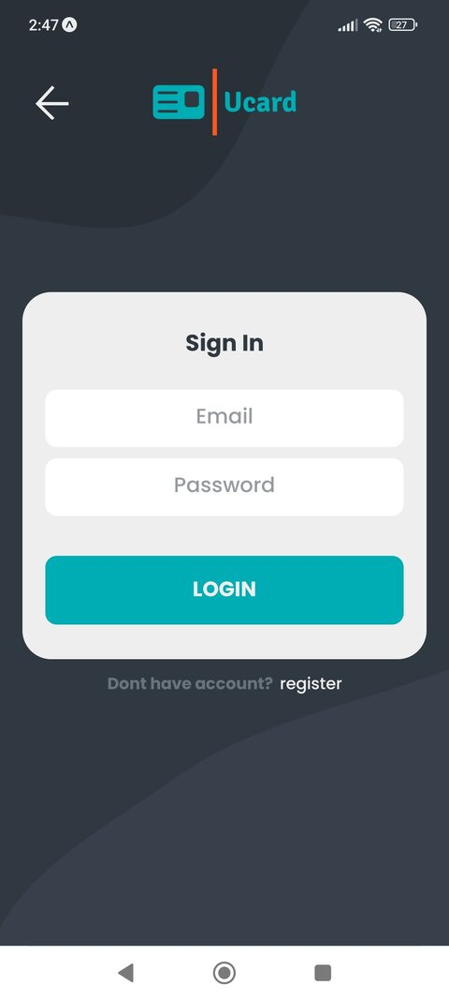

<div align="center">

> Hello world! This is the project’s summary that describes the project plain and simple, limited to the space available. 
 


**[PROJECT PHILOSOPHY](https://github.com/hassankhalil33/ucard#project-philosophy) • [PROTOTYPES](https://github.com/hassankhalil33/ucard#wireframes) • [TECH STACK](https://github.com/hassankhalil33/ucard#tech-stack) • [IMPLEMENTATION](https://github.com/hassankhalil33/ucard#impplementation) • [HOW TO RUN?](https://github.com/hassankhalil33/ucard#how-to-run)**

</div>

<br><br>


> Ucard allows you to create your own Unique Digital Business Card that you can share with others by tapping your phone or scanning a code. Ucard matches Cards with similar attributes together as suggested Cards.
> 
> Ever been to an event and wanted to exchange cards with peers? Ever got bored of carrying multiple plastic/paper cards? Ever thought about Mother Earth? 
Then Ucard is for you!

### User Stories
- As a user, I want to create custom personal cards.
- As a user, I want to edit my cards, so that I can update my info.
- As a user, I want to create different category cards (personal / business / gaming), so that I can own multiple cards.
- As a user, I want to share my card with others (NFC / QRCode), so that we can exchange info.
- As a user, I want to get matched with others, so I can find people with similar interests.
- As a user, I want to receive notifications, so that I stay upto date.

<br><br>


> This design was planned before on paper, then moved to Figma app for the fine details.
Note that i didn't use any styling library or theme, all from scratch and using pure css modules

|  Welcome  |    Login    | Register |
| --------- | ----------- | -------- |
|  |  | 

|      Home Page      | Home Page Continued  | Notifications Page  |
| ------------------- | -------------------- | ------------------- |
|  |  | 

| Contacts Page  | Cards Page  | Cards Page Continued
| ----- | ----- | ----- |
|  |  | 

<br><br>


Here's a brief high-level overview of the tech stack the Ucard app uses:

- This project uses [React Native EXPO](https://expo.dev/) for the Frontend. Expo is a bundle of tools created around React Native to help you start an app very fast. Coupled with [TypeScript](https://www.typescriptlang.org/). TypeScript is a strongly typed programming language that builds on JavaScript, giving you better tooling at any scale.
- This project uses [ExpressJS](https://expressjs.com/) for the Backend. Fast, unopinionated, minimalist web framework for [NodeJS](https://nodejs.org/en/).
- For persistent storage (database), the app uses the [Mongoose ODM](https://mongoosejs.com) package which allows the app to create a custom storage schema and save it to [MongoDB](https://www.mongodb.com).
- To send push notifications, the app uses [FireBase FCM](https://firebase.google.com/docs/cloud-messaging) package which supports Android and iOS.


<br><br>


> Using the above mentioned tech stacks and the wireframes built with figma from the user stories we have, the implementation of the app is shown below, these are screenshots/gifs from the real app.

| Welcome Page  | Register Page | Login Page  |
| ------------- | ------------- | ----------- |
|  |  | 

| Home Page  | Notifications Page  | Contacts Page  |
| ---------- | ------------------- | -------------- |
|  |  | 

| Cards Page  | Cards Page Continued  |
| --------------------------- | --------------------------- |
|  | 

| Welcome  | Home Page  | Notifications Page  |
| -------- | ---------- | ------------------- |
|  |  | 

| Contacts Page  | Cards Page  | Scan QR  |
| -------------- | ----------- | -------- |
|  |  | 

| Receive Push Notifications  |
| --------------------------- |
| 


<br><br>


> This is an example of how you may give instructions on setting up your project locally.
To get a local copy up and running follow these simple example steps.

### Prerequisites

This is an example of how to list things you need to use the software and how to install them.
* npm
  ```sh
  npm install npm@latest -g
  ```

### Installation

_Below is an example of how you can instruct your audience on installing and setting up your app. This template doesn't rely on any external dependencies or services._

~~ Frontend:
1. Clone the repo
   ```sh
   git clone https://github.com/hassankhalil33/ucard.git
   ```
2. Navigate to the frontend folder
   ```sh
   cd frontend/
   ```
3. Install NPM packages
   ```sh
   npm install
   ```
   🚨 you might need to run `npm install --force`  if you face any dependency conflicts.
4. Install Expo CLI
   ```sh
   npm install --global expo-cli
   ```
5. Rename `.env.example` to `.env` then set your credentials.
6. Install Expo Go app for Android (Optional)
   > [Android Play Store](https://play.google.com/store/apps/details?id=host.exp.exponent)
7. Run the Start-Up Command
   ```sh
   npx expo start -c
   ```
8. Scan the QR Code with Expo Go App.
    -or-
   Press 'a' to run locally on Android Emulator (Requires an Active Android Emulator [Android Studio](https://developer.android.com/studio/install)).
   
~~ Backend:
1. Navigate to the backend folder (from root folder)
   ```sh
   cd backend/
   ```
2. Install NPM packages
   ```sh
   npm install
   ```
3. Rename `.env.example` to `.env` then set your credentials.
4. Run the Start-Up Command
   ```sh
   npm start
   ```

